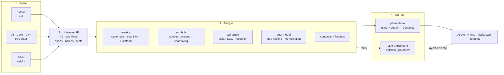

# Explain My Code

**Static analysis that explains itself.** Paste Python, JavaScript, Java, C++ or SQL and get a
line-by-line walkthrough pitched at one of three audiences, plus complexity metrics, detected
concepts, and the findings a reviewer would leave.

[](https://github.com/ethanzhoucool/explain-my-code/actions/workflows/ci.yml)


**Live demo:** https://explain-my-code-w3sj.onrender.com · **API:** [`/docs`](https://explain-my-code-w3sj.onrender.com/docs)
*(Render free tier: the first request may take 30–60s while the instance wakes.)*

---

## What makes it different

Most code explainers match keywords and look up a canned sentence. This one **parses the code**,
**measures it**, and then **writes the sentence from the measurement**.

The consequence is that the output says things a template can't:

```python
@lru_cache(maxsize=None)
def fib(n):
    if n <= 1:
        return n
    return fib(n - 1) + fib(n - 2)
```

> `fib(n)` → **O(n)**. `fib` recurses but memoises, so each distinct input is computed once.
> 2 independent paths, cognitive complexity 1, recursive.

Delete the decorator and the same code is re-read as **O(2^n)** with a high-severity finding.
Nothing about that is in a lookup table. It comes from the decorator list on the parsed
function node and the count of self-calls in its body.

Three more things fall out of parsing properly:

| | |
|---|---|
| **A keyword inside a string is not a keyword** | `msg = "if you can for loop"` contains no control flow. A regex-based explainer reports two branches and a loop. |
| **Mutual recursion is visible** | `is_even` → `is_odd` → `is_even` is found by running Tarjan's algorithm over the call graph, not by checking whether a function's name appears in its own body. |
| **Broken code still explains** | A syntax error on line 40 does not blank the page; Python falls back to the longest parsable prefix, and tree-sitter returns a tree with `ERROR` nodes marked as warnings. |

---

## Architecture

Five languages, five very different grammars, **one** explanation phrasebook. That only works
because everything is lowered into a shared IR before anything tries to describe it.



**The IR is the load-bearing idea.** A Python `for x in xs`, a Java `for (String s : xs)` and a
C++ `for (const auto& x : xs)` all become `Kind.LOOP_FOREACH` carrying the same `meta` slots
(`target`, `iterable`, `counted`). One template explains all three:

```python
Kind.LOOP_FOREACH: {
    Level.ELI5:      "Goes through `{iterable}` one at a time, doing the same thing to each.",
    Level.BEGINNER:  "Repeats the block once for every item in `{iterable}`, calling it `{target}` each time round.",
    Level.DEVELOPER: "Iterates `{iterable}`, binding `{target}`.",
}
```

Adding a language means writing an adapter that maps its grammar onto existing kinds. It means
writing **no** new explanations.

---

## What it measures

| Pass | Output |
|---|---|
| **Complexity** | Cyclomatic (McCabe), cognitive (SonarSource: nesting is punished, so three nested `if`s score 6 where three sequential ones score 3), max nesting depth |
| **Volume** | Halstead vocabulary, volume, difficulty, effort, estimated writing time |
| **Maintainability** | Classic MI normalised to 0–100, graded A–F |
| **Cost** | Asymptotic estimate per function, with the reason stated and a confidence attached |
| **Structure** | Call graph, mutual-recursion cycles, external callees, scope tree, unused and shadowed bindings |
| **Concepts** | 31 named ideas (closures, memoisation, guard clauses, RAII, window functions…), each explained at all three levels |
| **Findings** | Bare excepts, swallowed errors, mutable default arguments, unbounded loops, exponential recursion, `SELECT *`, cross joins, unfiltered `DELETE`, unbalanced allocations |

Every threshold is quoted in the message it produces. A finding that says "too complex"
without saying *how* complex, against *what* limit, is not an explanation.

---

## Quick start

```bash
git clone https://github.com/ethanzhoucool/explain-my-code.git
cd explain-my-code
python3 -m venv .venv && source .venv/bin/activate
pip install -e .

emc serve                 # web UI + API on http://127.0.0.1:5000
```

### CLI

```bash
emc explain path/to/file.py --level developer
emc explain app.js --level eli5
cat query.sql | emc explain - --language sql
emc metrics src/parser.py --format json
emc detect mystery_file
emc explain report.py --format markdown > EXPLAINED.md
```

`emc explain` prints the source with a complexity grade in the gutter, the explanation under
each line, then a function table, the concepts in play, and the findings.

### Python

```python
from explain_my_code import explain

result = explain(open("solver.py").read(), level="developer")

print(result.summary)
for line in result.lines:
    print(f"{line.line:>4}  {line.text}")

for function in result.analysis.functions:
    print(function.name, function.complexity_class, function.cyclomatic)
```

### HTTP

```bash
curl -X POST localhost:5000/v1/explain \
  -H 'content-type: application/json' \
  -d '{"code":"def f(x):\n    return x*2\n","level":"beginner"}'
```

| Endpoint | Purpose |
|---|---|
| `POST /v1/explain` | Parse, analyse, explain at one level |
| `POST /v1/explain/all-levels` | All three levels in one call, so the client switches level with no round trip |
| `POST /v1/explain/stream` | SSE: static explanation first, LLM enrichment streamed after |
| `POST /v1/analyze` | Metrics, findings, call graph, symbols. No prose |
| `POST /v1/detect` | Language detection with confidence |
| `GET /v1/languages` | Supported languages and their parsers |
| `GET /v1/concepts` | The full concept catalogue |
| `GET /healthz` | Version, parser availability, provider status, cache stats |

Full OpenAPI schema at `/docs`.

---

## The optional AI layer

Off by default. When enabled, it does not explain the code. The static pass already did
that. It receives the established facts and is asked only for what a parser cannot derive:
intent, naming quality, domain meaning, and likely bugs.

```
STATIC FACTS (already established, do not repeat these):
- 38 lines of code, cyclomatic complexity 11, maintainability 45.2/100
- Callables:
    line 7: constructor `__init__` (3 params, cyclomatic 1, O(1))
    line 12: method `cheapest` (3 params, cyclomatic 6, O(n²))
- Concepts detected: Recursion (x1), Guard clause (x2), Hash lookup (x3)
- Findings already reported (do not repeat):
    line 47: [high] Silently swallowed error
```

Three properties follow from that design:

- **It cannot contradict the parse tree.** The prompt forbids restating or contradicting the
  supplied facts; disagreements are routed to a `risks` field instead.
- **Output is schema-constrained and validated.** A line number outside the file is dropped, not
  rendered. A malformed reply degrades to the static explanation.
- **Provenance is visible.** Every enriched annotation is tagged `source: "llm"` with a
  confidence below 1.0, and the UI colours it differently from static analysis.

```bash
export ANTHROPIC_API_KEY=...        # or GEMINI_API_KEY
emc explain solver.py --enrich
```

| Variable | Purpose |
|---|---|
| `ANTHROPIC_API_KEY` | Claude (default provider, `claude-opus-5`) |
| `GEMINI_API_KEY` | Gemini (`gemini-2.0-flash`) |
| `EMC_PROVIDER` | Force `anthropic` or `gemini` |
| `EMC_CACHE_DIR` | Persist the enrichment cache to disk |
| `EMC_RATE_LIMIT` | Requests per minute per IP (default 60) |

Results are cached content-addressed on source + language + level + provider + model, so
re-explaining the same snippet is free.

---

## Performance

The static pipeline is the whole product; the network call is the optional part.

| Stage | Typical |
|---|---|
| Parse | 0.23 ms |
| Analyse | 0.21 ms |
| Narrate | 0.11 ms |
| **Total** | **~0.6 ms** (median 0.31 ms over 50 runs) |

That is why `/v1/explain/all-levels` returns all three levels at once: computing the other two
costs less than the round trip to ask for them.

---

## Project layout

```
explain_my_code/
├── ir.py                     # the universal IR: node kinds, spans, annotations
├── core.py                   # explain(), the single entry point
├── cache.py                  # content-addressed LRU + optional disk tier
├── cli.py                    # emc
├── adapters/                 # source → IR
│   ├── python.py             #   CPython ast (+ tokenize for comments)
│   ├── treesitter.py         #   shared tree-sitter machinery
│   ├── javascript.py │ java.py │ cpp.py
│   └── sql.py                #   sqlglot, with offset→span reconstruction
├── analysis/                 # IR → facts
│   ├── metrics.py            #   cyclomatic, cognitive, Halstead, MI
│   ├── symbols.py            #   scope tree, unused, shadowing
│   ├── callgraph.py          #   Tarjan SCC, recursion, external callees
│   ├── complexity.py         #   asymptotic heuristic
│   ├── concepts.py           #   31-concept catalogue
│   ├── findings.py           #   risk and quality rules
│   └── pipeline.py           #   runs them in dependency order
├── narrate/                  # facts → prose
│   ├── phrasebook.py         #   (Kind × Level) → sentence
│   ├── annotate.py           #   density control, line anchoring, summaries
│   └── llm.py                #   grounded enrichment, schema-validated
└── api/                      # FastAPI + pydantic schemas
web/                          # zero-dependency front end
tests/                        # 145 tests
```

---

## Extending it

**Add a language:** write an adapter that maps the grammar onto existing `Kind`s:

```python
@register(Language.RUBY)
class RubyAdapter(TreeSitterAdapter):
    parser_name = "tree-sitter-ruby"
    KINDS = {"method": Kind.METHOD, "if": Kind.BRANCH, "while": Kind.LOOP_WHILE, ...}
```

Every existing explanation, metric, concept and finding applies immediately.

**Add a concept:** one entry, three audiences, one detector:

```python
Concept(
    "sliding-window", "Sliding window", "algorithms",
    eli5="Looks at a small group at a time, sliding along one step at a time.",
    beginner="Keeps a moving range over the sequence instead of re-scanning it.",
    developer="Amortised O(n) over what a naive re-scan does in O(n·k).",
    detect=lambda root, lang: [...],
)
```

**Add a finding:** a rule in `analysis/findings.py` that names its threshold in the message.

---

## Testing

```bash
pip install -e ".[dev]"
pytest                       # 145 tests, ~0.4s
ruff check explain_my_code tests
```

The suite parametrises the same structural assertions across all five languages, so a grammar
update that renames a field fails a test rather than silently dropping explanations.

---

## Deploying

Any host that reads a `Procfile`:

```
web: uvicorn explain_my_code.api.main:app --host 0.0.0.0 --port $PORT --workers 1
```

Nothing needs to be set for the static analysis to work. Set an API key only if you want the AI
layer, and `EMC_CACHE_DIR` only if you want the enrichment cache to survive restarts.

---

## Notes and limitations

- **The cost estimate is a heuristic and says so.** It reads loop nesting, recursion shape and a
  table of known library costs. It carries a confidence value and is labelled as an estimate
  everywhere it appears. It will not see through indirection or data-dependent bounds.
- **Analysis is single-file.** "Assigned but never read" means *in this snippet*. It never
  claims dead code, because it cannot see the rest of the program.
- **C++ templates are parsed, not instantiated.** tree-sitter gives the syntax; no type checking
  or overload resolution happens.
- **SQL spans are reconstructed.** sqlglot attaches offsets only to leaf tokens, so a clause's
  span is the union of its descendants extended backwards over the leading keyword.

## License

MIT
